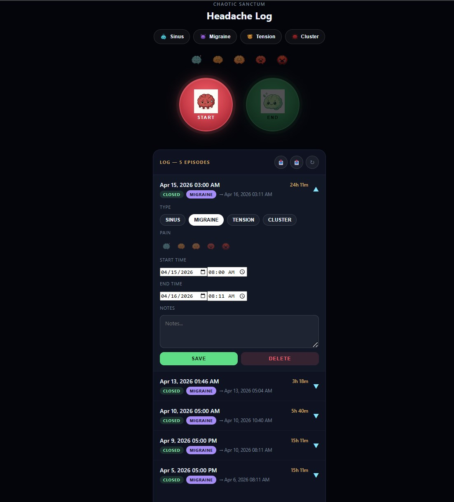

# simple-headache-log

A self-hostable headache tracking app. Track migraine episodes, log pain levels, and export your data — all from a single Docker container that runs anywhere.

## Screenshots

| Main View | Expanded Episode |
|-----------|-----------------|
|  |  |

## Features

- **One-tap start/stop** — red START button begins a headache, green END button closes it
- **Type selector** — tag episodes as Sinus, Migraine, Tension, or Cluster with color-coded pill buttons
- **Pain rating** — 1–5 brain icon scale
- **Episode journal** — expand any entry to edit date/time, type, pain level, and notes
- **Import / Export** — CSV import and export for backup or migration
- **Mobile-first design** — matches the Android app layout and works on phone, tablet, and desktop
- **Self-hosted** — your data stays on your hardware

## Quick Start (Portainer)

### Stack deploy

In Portainer, create a new **Stack** and paste this:

```yaml
name: headache-log
version: "3.8"
services:
  headache-log:
    image: ghcr.io/iampatticus/simple-headache-log:main
    container_name: headache-log
    restart: unless-stopped
    ports:
      - "5002:5000"
    volumes:
      - headache-data:/app/data
    environment:
      - PORT=5000
      - DATA_FILE=/app/data/headache-log.json

volumes:
  headache-data:
```

The `name: headache-log` at the top is required — it tells Portainer to manage this as a stack.

---

## First Run

Open `http://your-host:5002` in your browser (adjust the port if you changed the host port in the YAML above).

- Tap the **red brain** to start tracking a headache
- Tap the **green brain** to stop the current episode
- Tap any log entry to expand it and add notes

## Data Location

Inside the container, data lives at `/app/data/headache-log.json` (persisted via the named volume).

To backup, use:

```bash
docker cp headache-log:/app/data/headache-log.json ./headache-log-backup.json
```

## Environment Variables

| Variable | Default | Description |
|----------|---------|-------------|
| `PORT` | `5000` | Internal container port |
| `DATA_FILE` | `/app/data/headache-log.json` | Path to the data file |

## Building from source

```bash
git clone https://github.com/IamPatticus/simple-headache-log.git
cd simple-headache-log
docker build -t headache-log .
docker run -d -p 5002:5000 --name headache-log headache-log
```

## API Endpoints

| Method | Endpoint | Description |
|--------|----------|-------------|
| `GET` | `/` | Serve web UI |
| `GET` | `/health` | Health check |
| `POST` | `/headache-log-add` | Start a new episode |
| `POST` | `/headache-log-end` | End most recent episode |
| `POST` | `/headache-log-edit` | Edit an entry |
| `POST` | `/headache-log-import` | Import CSV |
| `DELETE` | `/headache-log-delete?id=<id>` | Delete an entry |

## Tech Stack

- **Backend:** Python 3 stdlib (`http.server`)
- **Frontend:** Vanilla HTML/CSS/JS, no build step
- **Storage:** JSON file (SQLite-ready upgrade path)
- **Container:** Docker / Podman

## License

### Adding screenshots

Drop your screenshots into the `screenshots/` folder as:
- `main-view.png` — the full app UI with buttons and log
- `expanded.png` — an episode expanded showing edit fields

Then commit and push — GitHub will render them in the README automatically.

## License

CC0 — public domain, do whatever you want with it.
